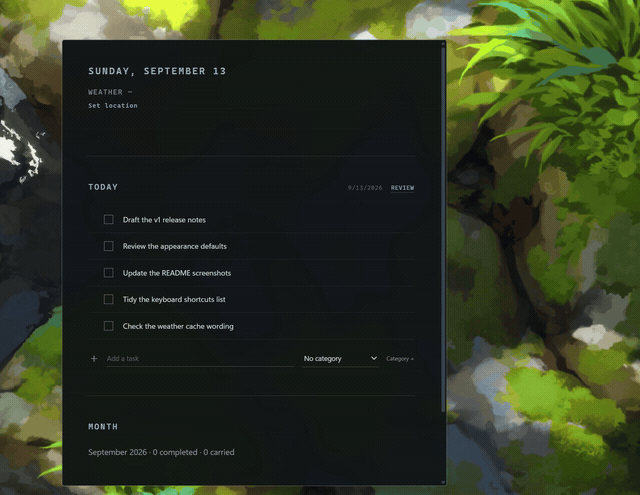
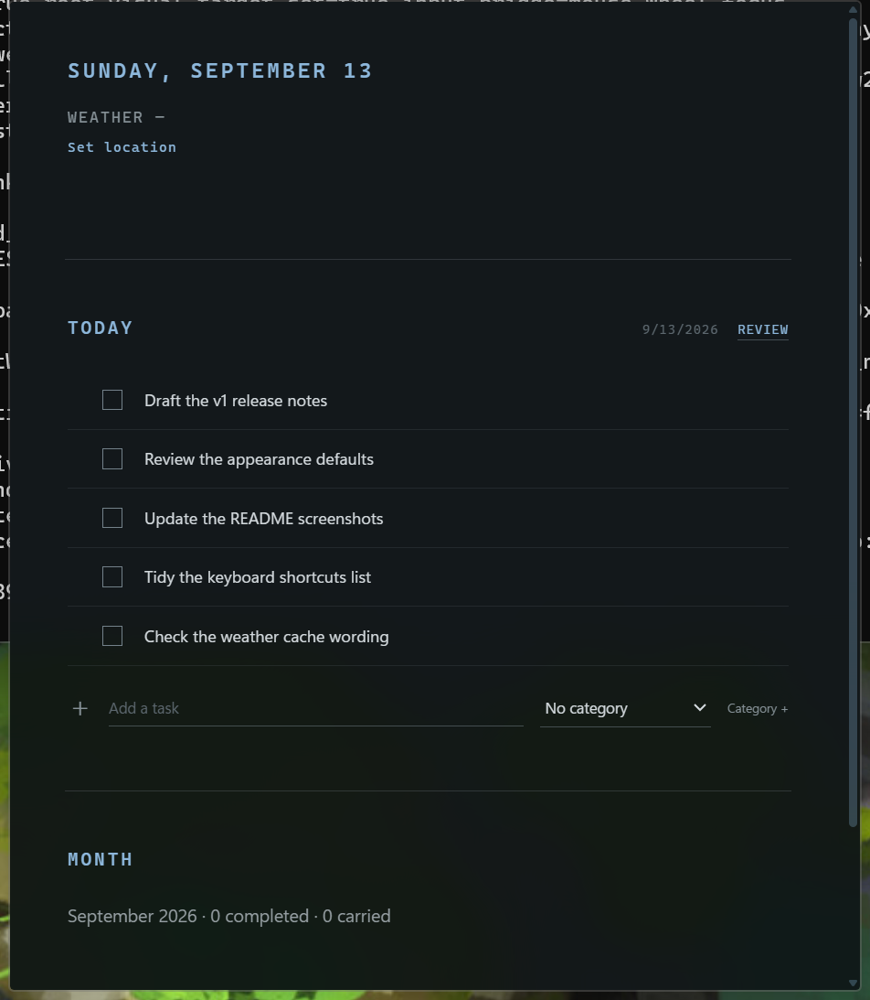
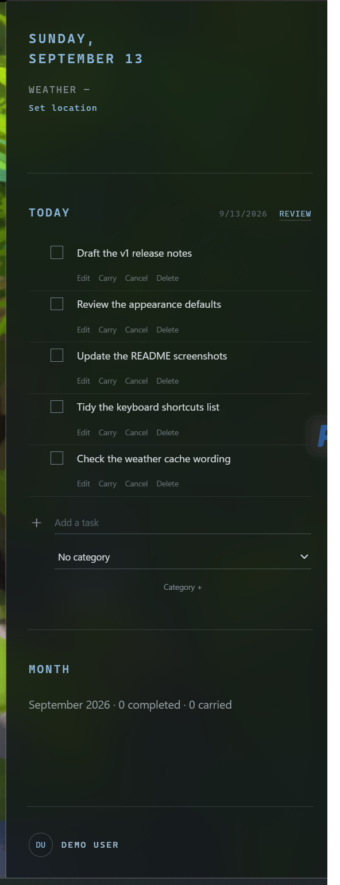
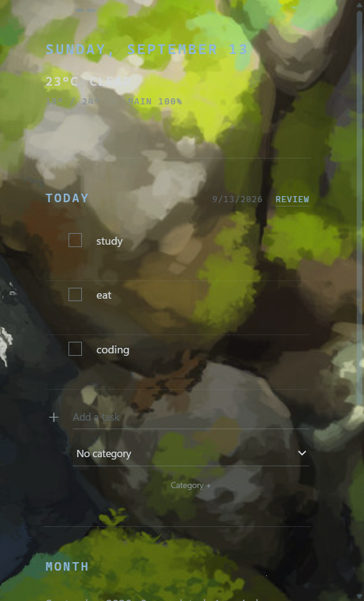

**English** | [简体中文](README_ZH.md)

# desktop-todo-widget

A local-first Windows todo widget built around three window modes: **Sidebar**, **Floating**, and **Desktop**.

It focuses on lightweight task management, tray-first interaction, customizable appearance, Quick Links, weather, and native Windows integration.

`Rust` · `Tauri` · `Vue 3` · `TypeScript` · `WebView2` · `SQLite`

## Screenshots

<p align="center">
  <a href="docs/assets/demo.gif"></a>
</p>

[Watch the MP4 recording](docs/assets/demo.mp4)

<p align="center">
  <a href="docs/assets/floating-acrylic.png"></a>
</p>

<table>
  <tr>
    <th align="center">Orb</th>
    <th align="center">Sidebar</th>
    <th align="center">Desktop</th>
  </tr>
  <tr>
    <td align="center"><a href="docs/assets/orb.png"></a></td>
    <td align="center"><a href="docs/assets/sidebar.png"></a></td>
    <td align="center"><a href="docs/assets/desktop.png"></a></td>
  </tr>
</table>

## Download

The current Windows x64 release is available from [GitHub Releases](https://github.com/alanfloyd-dev/desktop-todo-widget/releases).

Download `desktop-todo-widget-v1.0.0-windows-x64.zip`, extract it, and run:

`desktop-todo-widget.exe`

The v1.0.0 release is currently distributed as a portable ZIP. No installer is included yet.

### Windows compatibility

- Tested on Windows 11.
- Windows 10 1809+ is expected to work based on the underlying platform requirements, but has not yet been fully validated.
- WebView2 Runtime is required.

## Features

**Todo lifecycle** — add, edit, complete, reopen, cancel, carry, delete, and reorder. Carry is history-preserving: the original row is marked `carried` and a linked successor is created for the next task day in one SQLite transaction.

**Window modes** — Sidebar, Floating, and Desktop share one window and one WebView; Floating collapses to a 56 DIP avatar Orb. See [Window modes](#window-modes).

**Appearance profiles** — each window mode keeps its own profile: Glass, Solid, two-stop Gradient, a managed local image, or the current Windows wallpaper, plus tint, opacity, blur, overlay, image fit/position, and an optional custom text colour.

**Quick Links** — add, edit, reorder, and delete your own links; only `http://` and `https://` URLs are accepted.

**Weather** — optional current conditions and today's high/low with a locally cached snapshot and a clear "not configured" state.

**Review** — read-only Daily, Weekly, and Monthly Review aggregated from local task history. No scores, trends, or advice.

**Language** — English, Simplified Chinese, or System (follows the Windows display language).

**Windows integration** — tray-resident, no taskbar button, no ordinary Alt+Tab entry, right-click context menu on the widget and the Orb, and per-mode window geometry that survives restarts. Verified at 150% display scaling.

## Window modes

**Sidebar** — edge-oriented widget mode. Occupies the monitor work-area height, docks to the left or right edge, and remembers side and width. Dragging Floating near an edge enters Sidebar.

**Floating** — a movable, frameless window and the first-run default. It can collapse to the Orb and expand again, and it keeps its expanded size and Orb anchor as independent saved values. The Enhanced rendering backend supports native Acrylic in this mode.

**Desktop** — a desktop-hosted frameless widget. It is reparented as a child of the Windows desktop host, so the wallpaper, desktop icons, and the native desktop context menu stay usable around it. It is movable and resizable when unlocked, with geometry independent from Floating, and always-on-top is unavailable.

### Native Acrylic is unavailable in Desktop mode

This is a design and platform constraint, not a regression:

- Desktop is hosted as a child window under the Windows desktop hierarchy (`SHELLDLL_DefView`), which is not a documented public embedding API.
- The native Acrylic path requires top-level HWND semantics; a composition-hosted backdrop cannot be attached to that child window.
- Desktop therefore uses the documented translucent Graphite fallback, and the native menu labels it `Desktop (Acrylic unavailable)`.

See [docs/desktop-mode.md](docs/desktop-mode.md) for the attach/detach lifecycle and host discovery details.

## Rendering backends

The WebView2 hosting backend is chosen in Settings and applies after a restart. It is orthogonal to the window mode: Sidebar, Floating, and Desktop all work on either backend. **Standard** is the v1 default.

| Backend | Hosting | Notes |
| --- | --- | --- |
| **Standard** | Ordinary windowed WebView2 (`ICoreWebView2Controller`) | Compatibility-oriented and the recommended choice when composition features are unnecessary. Exposes the WebView content to Windows UI Automation. |
| **Enhanced** | Composition-hosted WebView2 (`ICoreWebView2CompositionController`) | Enables native Acrylic in Floating. A deeper Windows-specific implementation, and its conventional UI Automation / accessibility behavior is more limited. |

See [docs/phase-7c3b4-dual-backend-release-decision.md](docs/phase-7c3b4-dual-backend-release-decision.md) and [docs/native-composition.md](docs/native-composition.md).

## Appearance profiles

Appearance is per window mode: editing Sidebar's material cannot change Floating's. Each profile stores the background type, tint, opacity, blur, and overlay values, image fit and position, the text contrast mode, and the custom text colour.

- Background types: Glass, Solid, Gradient, managed local image, current Windows wallpaper.
- Text contrast: Auto, Light, Dark, or Custom. Auto samples solid colours and gradient stops directly, and samples image/wallpaper data once at 32×32.
- Missing, corrupt, or oversized images resolve to the safe Glass fallback instead of breaking the surface.

See [docs/appearance.md](docs/appearance.md).

## Quick Links

Quick Links are user-managed name/URL pairs shown as a product section: add, edit, reorder, delete. Names and URLs are your own data and are never translated. A link is validated as `http`/`https` with a host when it is saved and again immediately before it is opened. An empty list simply hides the section.

## Weather and Review

Weather is optional ambient information rather than a startup dependency. Location search runs only after an explicit action, you must pick a result yourself, and forecasts then use the saved coordinates and timezone. Cached snapshot freshness is graded, and a failed refresh keeps the last valid cache. Weather data by [Open-Meteo.com](https://open-meteo.com/) under [CC BY 4.0](https://creativecommons.org/licenses/by/4.0/); attribution is shown in Settings and in [THIRD_PARTY_NOTICES.md](THIRD_PARTY_NOTICES.md).

Review is a read-only projection over raw task history: Daily (one task day), Weekly (Monday–Sunday), or Monthly (calendar month). It reports Planned, Completed, Carried, Cancelled, and Pending counts plus task-day and category distributions, and it stores no report snapshots.

See [docs/weather.md](docs/weather.md) and [docs/reviews.md](docs/reviews.md).

## Data and privacy

- **Local-first.** Tasks, settings, appearance profiles, Quick Links, profile identity, and the weather cache live on this machine.
- **No account.** There is no sign-in, hosted identity, or sync server.
- **No intentional upload.** Task, profile, appearance, and Quick Link data are not sent anywhere by the application.
- **Weather is the one remote call.** Open-Meteo receives the geocoding and forecast request needed to answer a location you configured. With no configured location, no weather request is made.
- **Diagnostics are opt-in.** Settings → Developer → Copy diagnostics produces an allowlisted, privacy-minimized report with runtime/window metadata and non-sensitive appearance state. It excludes task content, profile values, weather location, asset filenames/paths, and exact database paths.

### Internal compatibility identifiers

Some shipping identifiers keep their pre-release `alan-desktop` spelling on purpose, because renaming them would strand existing user data or break upgrades. They are internal names, not the product name:

- `alan-desktop` — the Rust crate name, the private `package.json` name, and therefore the built executable `alan-desktop.exe`.
- `alan-desktop.sqlite3` — the local database file, under the app-data directory `net.alanfloyd.desktop`.
- `alan-desktop-tray` — the tray icon id.

The public product name is `desktop-todo-widget`, which is what the tray tooltip, the tray/context menu heading, and the window title use. See [docs/data-model.md](docs/data-model.md).

## Development note

This project is built with significant AI assistance.

I am a geology student rather than a computer science student, and my main technical direction is Python and data analysis for scientific work. Windows internals, Rust, Tauri, and WebView2 are not my primary stack, so I do not claim deep expertise in every implementation detail.

That said, this is not a one-shot AI-generated repository. I remain involved in product design, architecture decisions, testing, debugging, manual QA, and release review. The codebase includes comments, tests, and technical documentation intended to make the implementation easier to inspect and maintain.

The project is actively maintained, and I expect to keep improving it as I learn more.

Contributions are very welcome — especially bug reports, code review, Windows platform expertise, and cleaner implementations of areas that could be improved.

AI-assisted contributions are also welcome, but please review, test, and understand the changes you submit.

## Architecture

High level: Vue 3 + TypeScript render the product surface and own presentation state; Rust owns OS paths, persistence, the window/tray lifecycle, and the Win32 boundary; the Win32/WebView2 layer stays behind a narrow adapter. The UI never manipulates HWNDs or SQLite directly.

- **Tauri** — application shell, window/tray lifecycle, IPC commands and events.
- **Rust** — product settings, SQLite repository and migrations, task lifecycle, reviews, weather adapter, appearance validation.
- **Vue 3 + TypeScript** — presentation, per-mode layout, settings, review, weather display.
- **WebView2** — windowed (`Standard`) or composition-hosted (`Enhanced`) rendering surface.
- **SQLite** — local task/history/category/weather storage; typed JSON settings in `app_settings`.
- **Windows Composition APIs** — the Enhanced backend's composition host, Desktop Acrylic controller, and visual tree.

See [ARCHITECTURE.md](ARCHITECTURE.md) and [docs/](docs/) for the module-by-module detail.

### Windows-specific maintenance note

Some Windows-specific window hosting and mode-management code is intentionally conservative and currently more centralized than ideal. In particular, `src-tauri/src/window_mode.rs` and `src-tauri/src/product_window.rs` carry most of it.

This is known technical debt rather than something unexamined: those modules contain behavior shaped by real bug fixing and QA around platform compatibility, lifecycle, input, DPI, desktop hosting, window styles, Win+D behavior, taskbar/Alt+Tab semantics, and recovery paths.

Refactoring is planned after v1 stabilization, but behavioral stability takes priority over structural cleanup. Changes there are best kept small and behavior-preserving, and their constraints are documented in [CONTRIBUTING.md](CONTRIBUTING.md) and [docs/desktop-mode.md](docs/desktop-mode.md).

## Building from source

Requirements: Windows 11, Node.js 20+, pnpm, Rust stable with the MSVC target, the Windows SDK, and the WebView2 Runtime.

```powershell
pnpm install
pnpm build
cargo test --manifest-path src-tauri/Cargo.toml
pnpm tauri build --no-bundle
```

The Windows build also stages the self-contained Windows App SDK payload beside the executable. `build.rs` fails with the exact command if it is missing, because the Enhanced (composition-hosted) backend needs it at runtime:

```powershell
powershell -ExecutionPolicy Bypass -File tools/windows-app-sdk/prepare-runtime-payload.ps1
```

The payload is not committed; [docs/windows-app-sdk-runtime.md](docs/windows-app-sdk-runtime.md) is the authoritative description of its provenance and version policy.

`pnpm tauri:dev` runs the Vite dev server for frontend work. Production builds embed the compiled frontend and serve it through the Tauri custom protocol (`custom-protocol` feature), so a release build never depends on a dev server. v1 has no installer or updater pipeline: `pnpm tauri build --no-bundle` produces the executable and its runtime payload, and `bundle.active` is `false`.

## Known limitations

- **Desktop Acrylic** — unavailable by design. Desktop is hosted as a child of the Windows desktop hierarchy while the native Acrylic path needs top-level HWND semantics; Desktop uses the translucent Graphite fallback instead.
- **Enhanced accessibility** — composition hosting means the Enhanced backend offers more limited conventional Windows UI Automation behavior than Standard. Use Standard if you rely on screen readers or automation tools.
- **Windows-specific implementation** — Enhanced depends on Windows/WebView2/Tauri-specific behavior and may need compatibility updates as those platforms evolve.
- **Desktop host is undocumented** — `Progman`, `WorkerW`, and `SHELLDLL_DefView` topology can change across Windows updates and Explorer restarts.
- **Scope** — Windows 11 validated, no installer/updater, no sync, and no localization beyond English and Simplified Chinese.

## Roadmap

Planned after v1 stabilization:

- Evaluate extracting the Windows Composition / Acrylic hosting work into a standalone reusable project or library.
- Reports: broader factual review surfaces on the existing task history.
- Componentization: smaller, clearer frontend and Rust boundaries.
- Settings organization: group the current settings surface more deliberately.
- Installer and update improvements.

Deferred work is tracked in [FUTURE.md](FUTURE.md). Nothing in this section is implemented yet.

## Contributing

Contributions are welcome. Short version:

- Keep pull requests focused on one change.
- Explain platform-specific behavior and the Windows/WebView2 assumptions behind it.
- Add tests where practical; native mode changes still need the manual mode-transition checks.
- Preserve user data. Migrations must be idempotent, and destructive migrations are not acceptable.
- Do not regress Standard mode while changing Enhanced.
- AI-assisted pull requests are welcome, but you must review, test, and understand what you submit.

See [CONTRIBUTING.md](CONTRIBUTING.md).

## License

MIT — see [LICENSE](LICENSE). Copyright (c) 2026 Alan Floyd.

Dependency licenses and provenance notes are in [THIRD_PARTY_NOTICES.md](THIRD_PARTY_NOTICES.md).
